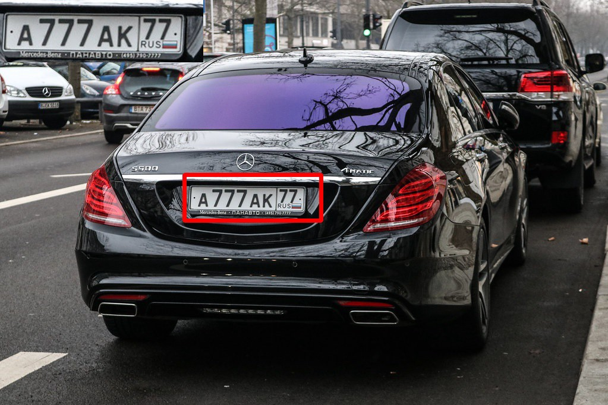
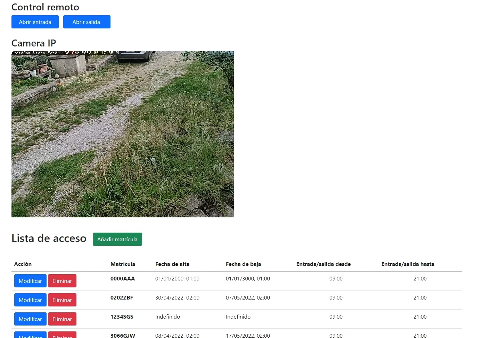

# **Parking Access Control w/ computer vision**

The idea behind this project is to be able to implement a parking access control system with license plate recognition in any established parking access control, and also be able to manage it remotely

* **React JS** cross-platform GUI
* **Spring Boot (Kotlin)** to be able to deploy the JVM on any OS
* **OpenAlpr** C++ library for license plate detection system
#

### **Current development status**

#### User GUI

#### Detect plate and activate relay using smartphone as IP camera

